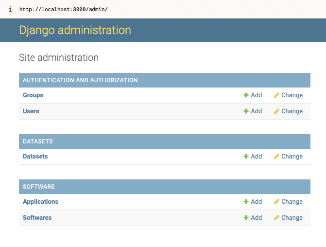
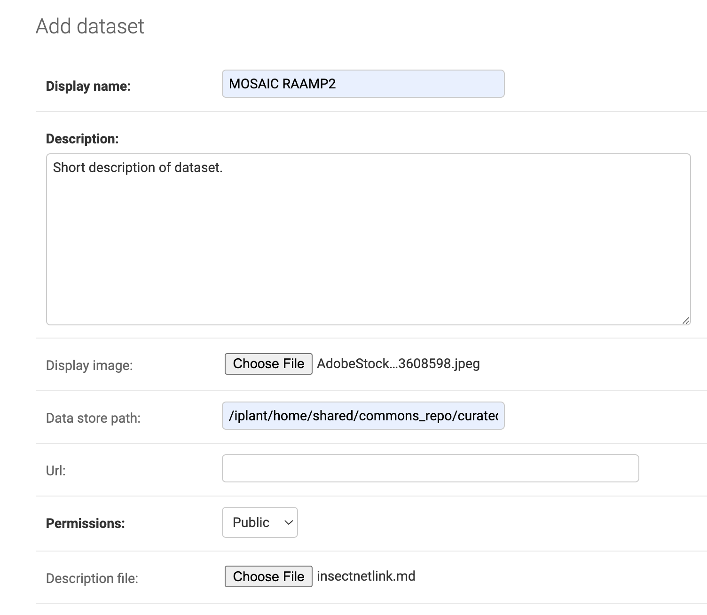
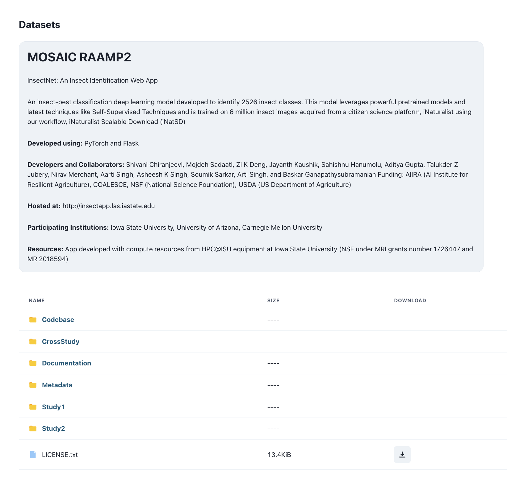
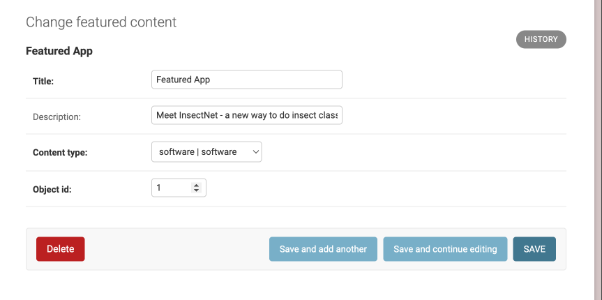
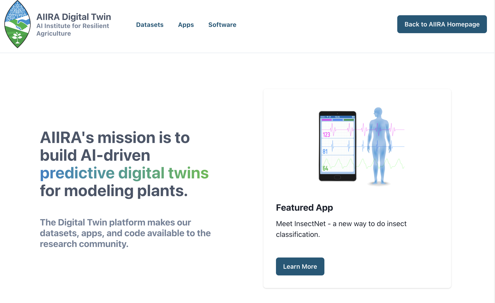

# aiira-digital-twin

AIIRA Digital Twin is a web application for displaying a collection of apps and datasets stored on the [CyVerse](https://cyverse.org/) Data Store. It uses a [Django](https://www.djangoproject.com/) backend and [NextJS](https://nextjs.org/) frontend.

### Development with docker-compose

1. After cloning the repository, copy `django/digital_twin/settings/local_example.py` to a new file `local.py`.
2. In `local.py`, set the `SECRET_KEY` attribute to a long random string, and if running remotely, add the host address to the `ALLOWED_HOSTS` list and add an entry `http://HOST_ADDRESS:3005` to `CORS_ORIGIN_WHITELIST` to allow the NextJS app to make requests to the Django app.
3. Copy the `.env.example` file in the root directory of the project into `.env`. and, replacing HOST_ADDRESS with the address of the machine you are developing on or `localhost` if developing locally.
4. Now we can build and run the project with docker compose using the following command:

   ```bash 
   docker compose up -f docker-compose.dev.yml --build -d
   ```
5. Next, apply the database migrations with:

   ```bash
   docker compose exec django python manage.py migrate --noinput
   ```
6. To verify everything is running correctly, check that you can view the NextJS app at http://localhost:3005 (though no content will be populated yet) and the Django admin login page at http://localhost:8000.
7. To add site content, we will use the Django admin. Create a Django superuser (has all permissions) with the following command. You will be prompted for a username, email address, and password.

   ```bash
   docker-compose exec django python manage.py createsuperuser
   ```
8. Login to the Django admin site at http://HOST_ADDRESS:8000 with the newly created superuser account. 


### Adding site content

Once logged into the Django admin, you can add Datasets, Software, and Apps. You can add additional users here too.



To add a Dataset, fill the fields as follows:

**Display name**: Name of the dataset.

**Description**: Short description of the dataset that will be shown in the list of datasets. Does not need to include all info about the dataset - full details of the dataset can go in the `Description File` field.

**Display image**: Display image for the dataset.

**Data store path**: Path to the dataset folder on the CyVerse datastore.  Should start with `/iplant/home/...`. Required if **URL** field is not specified.

**URL**: Alternatively an external URL can be specified if the dataset is not stored on CyVerse. Required if  **Data store path** field is not specified.

**Permissions**: Only public datasets are supported currently, so select `Public`.

**Description file**: Must be a Markdown (`.md`) file.  This is where you can write a longer description of the dataset, including acknowledgements, etc.



Adding Software and Applications is similar.

Navigate to `localhost:3005` and you can view the list of datasets, and when you select one you can see the details of the dataset (similar for software and apps).





### Adding Featured Content

To feature a Dataset, Software, or App on the homepage of the site, you can use the Featured Content section in the Django admin.  Currently only one item can be featured.



Title and description fields are provided to customize the text that shows in the "Featured" section.

To point to the Dataset, Software, or Application object we want to feature, we specify the `content_type` and `object_id`.

When selecting content type: 
+ Software = `software | software`
+ App = `software | application`
+ Dataset = `datasets | dataset`

`object_id` is ID of the particular Dataset/Software/Application object which can be found in the ID column for that object in the Django admin. The entry above displays like this:




