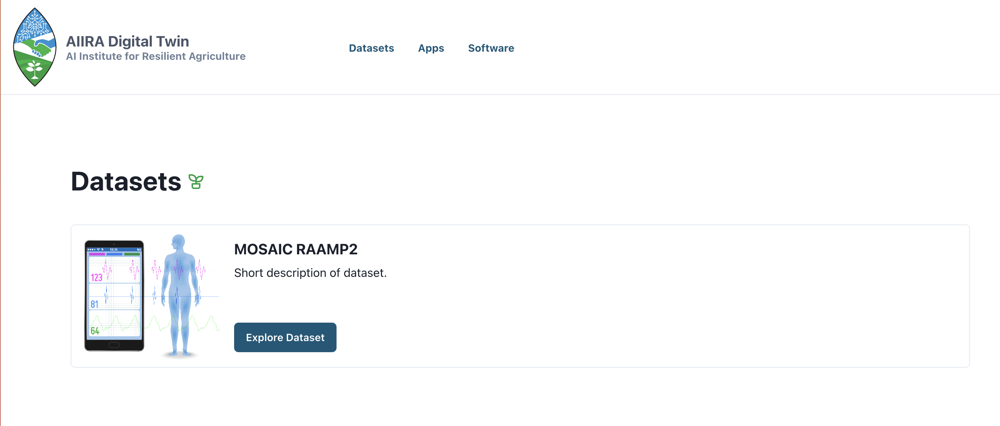

# aiira-digital-twin

AIIRA Digital Twin is a web application for displaying a collection of apps and datasets stored on the [CyVerse](https://cyverse.org/) Data Store. It uses a [Django](https://www.djangoproject.com/) backend and [NextJS](https://nextjs.org/) frontend.

### Docker setup

1. After cloning the repository, copy `django/digital_twin/settings/local_example.py` to a new file `local.py`.
2. In `local.py`, set the `SECRET_KEY` attribute to a long random string, and if running remotely, add the host address to the `ALLOWED_HOSTS` list.
3. Now we can build and run the project with docker compose using the following command:

   ```bash 
   docker compose up --build -d
   ```
4. Next, apply the database migrations with:

   ```bash
   docker compose exec django python manage.py migrate --noinput
   ```
5. To verify everything is running correctly, check that you can view the NextJS app at http://localhost:3005 (though no content will be populated yet) and the Django admin login page at http://localhost:8000.
6. To add site content, we will use the Django admin. Create a Django superuser (has all permissions) with the following command. You will be prompted for a username, email address, and password.

   ```bash
   docker-compose exec django python manage.py createsuperuser
   ```
7. Login to the Django admin site at http://localhost:8000 with the newly created superuser account. 


### Adding site content

Once logged into the Django admin, you can add Datasets, Software, and Apps. You can add additional users here too.


To add a Dataset, fill the fields as follows:

**Display name**: Name of the dataset.

**Description**: Short description of the dataset that will be shown in the list of datasets. Does not need to include all info about the dataset - full details of the dataset can go in the `Description File` field.

**Display image**: Display image for the dataset.

**Data store path**: Path to the dataset folder on the CyVerse datastore.  Should start with `/iplant/home/...`

**Permissions**: Only public datasets are supported currently, so select `Public`.

**Description file**: Must be a Markdown (`.md`) file.  This is where you can write a longer description of the dataset, including acknowledgements, etc.


Adding Software and Applications is similar.

Navigate to `localhost:3005` and you can view the list of datasets, and when you select one you can see the details of the dataset (similar for software and apps).




